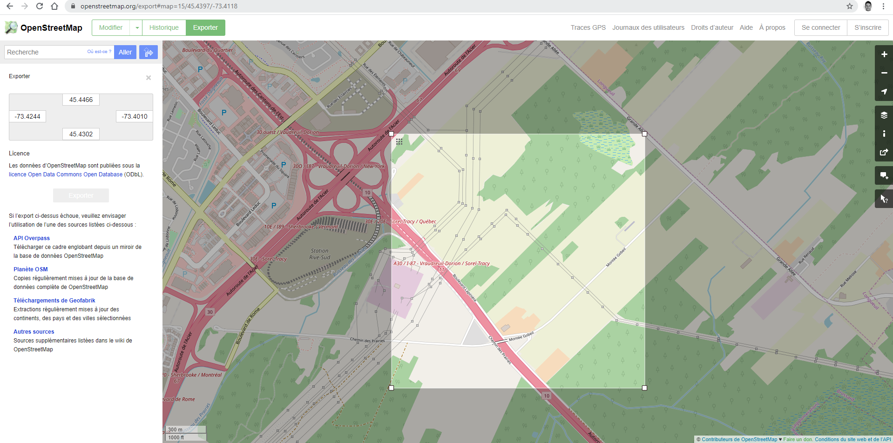
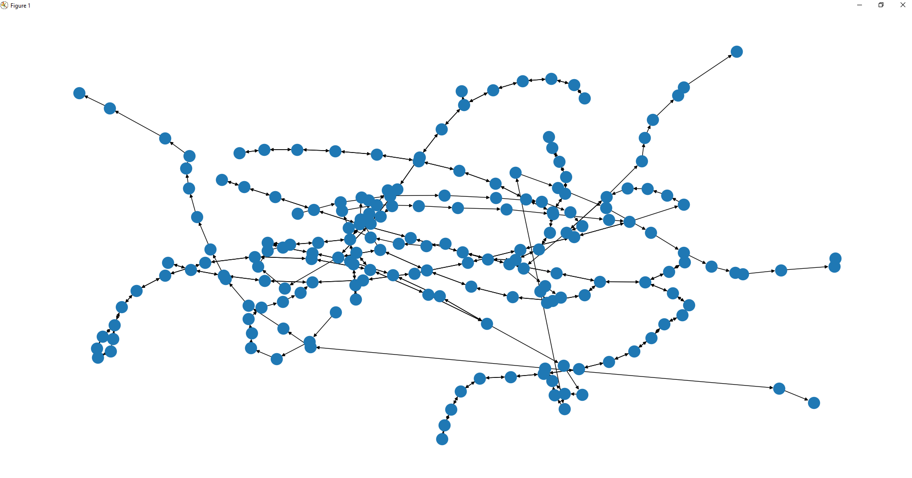
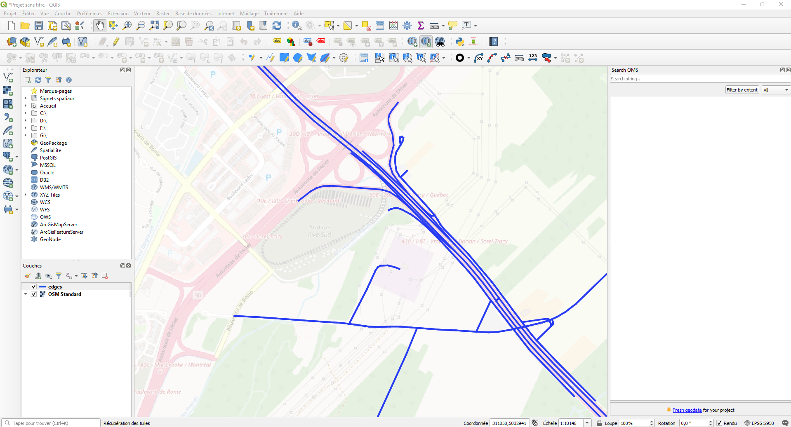

# OSM Road Parser
Convert a Open Street Maps `.map` format file into a networkx directional graph.

This parser is based on the osm to networkx tool from aflaxman : https://gist.github.com/aflaxman/287370/


Added :
- python3.6 compatibility
- networkx v2 compatibility
- cache to avoid downloading the same osm tiles again and again
- distance computation to estimate length of each ways (useful to compute the shortest path)

# Installation
```sh
pip install -r requirements.txt
```

# Examples




- Download osm data and display the networkx graph into matplotlib.

    ```sh
    python examples/display_osm_graph.py
    ```
- Load osm data from a `.map` file and convert the graph to shapefile
    ```sh
    # Requires osgeo python package --> https://pythongisandstuff.wordpress.com/2016/04/13/installing-gdal-ogr-for-python-on-windows/
    python examples/convert_osm_to_shp.py
    ```